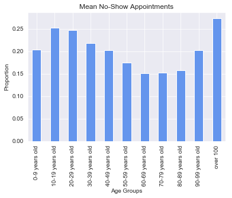
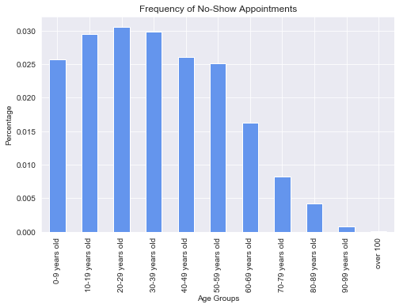
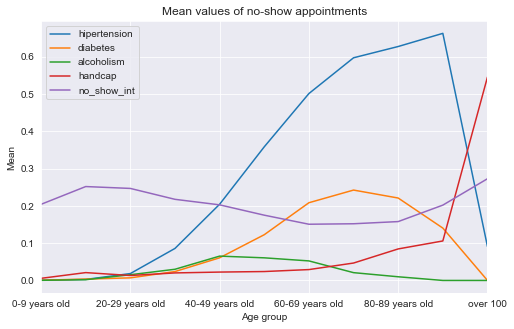
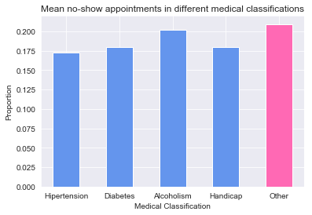
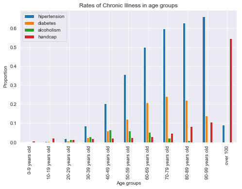
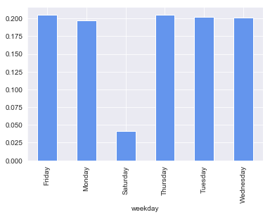
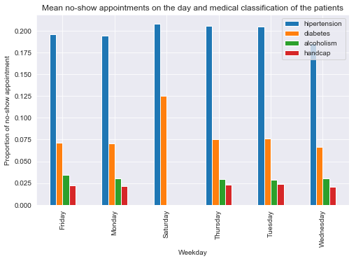
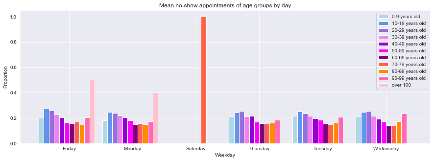

# Project: Investigate trends in missed appointments

## Table of Contents
<ul>
<li><a href="#intro">Introduction</a></li>
<li><a href="#wrangling">Data Wrangling</a></li>
<li><a href="#eda">Exploratory Data Analysis</a></li>
<li><a href="#conclusions">Conclusions</a></li>
</ul>

<a id='intro'></a>
## Introduction

In this project, I will investigate "No-show appointments" dataset which is collected from 100k medical appointments in Brazil. This report collects a number of characteristics about the patient and focuses on questioning whether patients show up for their appointments. 
 
Throughout this project, I will focus on certain variables to find a correlation between each variables and the no-show appointments and try to explore which of those variables have a strong correlation with missed appointments. 

### Questions  
> 1. Does the age of the patients affect the likelihood of no-show appointments? 
> 2. Does the certain chronic illness affect the patients' absences? Among Hipertention, Diabets, Alcoholism, and Handcap, patients with no chronic illness, which diagnosis are more or less likely to miss their appointments.
> 3. How different are the patients who has chronic desease or handicap from those who doesn't  in terms of their age.       
> 4. How does each day of a week different in terms of No-Show Appointment. Are there are any difference in characteristics of the patients in terms of their medical classification or ages.


```python
import pandas as pd
import numpy as np
import matplotlib.pyplot as plt
%matplotlib inline

import seaborn as sns
sns.set_style('darkgrid')

import data_investigation as di

df = pd.read_csv('noshowappointments-kagglev2-may-2016.csv')
```

<a id='wrangling'></a>
## Data Wrangling

> This investigation focuses mainly on age of the patients, scheduled appointment day, medical diagnoses, and the results of No-show appointments, so unneccessary columns will be removed. And columns will be renamed to increase efficiency. Also, for this investigation, 'ScheduledDay' will be converted from string to datetime. 

### General Properties


```python
df.head(3)
```


<div>
<style scoped>
    .dataframe tbody tr th:only-of-type {
        vertical-align: middle;
    }

    .dataframe tbody tr th {
        vertical-align: top;
    }

    .dataframe thead th {
        text-align: right;
    }
</style>
<table border="1" class="dataframe">
  <thead>
    <tr style="text-align: right;">
      <th></th>
      <th>PatientId</th>
      <th>AppointmentID</th>
      <th>Gender</th>
      <th>ScheduledDay</th>
      <th>AppointmentDay</th>
      <th>Age</th>
      <th>Neighbourhood</th>
      <th>Scholarship</th>
      <th>Hipertension</th>
      <th>Diabetes</th>
      <th>Alcoholism</th>
      <th>Handcap</th>
      <th>SMS_received</th>
      <th>No-show</th>
    </tr>
  </thead>
  <tbody>
    <tr>
      <th>0</th>
      <td>2.987250e+13</td>
      <td>5642903</td>
      <td>F</td>
      <td>2016-04-29T18:38:08Z</td>
      <td>2016-04-29T00:00:00Z</td>
      <td>62</td>
      <td>JARDIM DA PENHA</td>
      <td>0</td>
      <td>1</td>
      <td>0</td>
      <td>0</td>
      <td>0</td>
      <td>0</td>
      <td>No</td>
    </tr>
    <tr>
      <th>1</th>
      <td>5.589978e+14</td>
      <td>5642503</td>
      <td>M</td>
      <td>2016-04-29T16:08:27Z</td>
      <td>2016-04-29T00:00:00Z</td>
      <td>56</td>
      <td>JARDIM DA PENHA</td>
      <td>0</td>
      <td>0</td>
      <td>0</td>
      <td>0</td>
      <td>0</td>
      <td>0</td>
      <td>No</td>
    </tr>
    <tr>
      <th>2</th>
      <td>4.262962e+12</td>
      <td>5642549</td>
      <td>F</td>
      <td>2016-04-29T16:19:04Z</td>
      <td>2016-04-29T00:00:00Z</td>
      <td>62</td>
      <td>MATA DA PRAIA</td>
      <td>0</td>
      <td>0</td>
      <td>0</td>
      <td>0</td>
      <td>0</td>
      <td>0</td>
      <td>No</td>
    </tr>
  </tbody>
</table>
</div>


### Data Cleaning


##### 1. Check for missing values and duplicates


```python
# find missing values
df.info()
```

    <class 'pandas.core.frame.DataFrame'>
    RangeIndex: 110527 entries, 0 to 110526
    Data columns (total 14 columns):
    PatientId         110527 non-null float64
    AppointmentID     110527 non-null int64
    Gender            110527 non-null object
    ScheduledDay      110527 non-null object
    AppointmentDay    110527 non-null object
    Age               110527 non-null int64
    Neighbourhood     110527 non-null object
    Scholarship       110527 non-null int64
    Hipertension      110527 non-null int64
    Diabetes          110527 non-null int64
    Alcoholism        110527 non-null int64
    Handcap           110527 non-null int64
    SMS_received      110527 non-null int64
    No-show           110527 non-null object
    dtypes: float64(1), int64(8), object(5)
    memory usage: 11.8+ MB
    


```python
# find duplicates
df.duplicated().sum()
```


    0


##### 2. Dropping columns
`PatientId`, `AppointmentID`, `Gender`, `AppointmentDay`, `Neighbourhood`, `Scholarship`, and `SMS_received` will be removed.


```python
df.drop(['PatientId','AppointmentID','Gender','AppointmentDay', 'Neighbourhood', 'Scholarship', 'SMS_received'], axis=1, inplace=True)
```

##### 3. Renaming columns
Lower the column names and replace dash(-) with underscore(_).


```python
#Use lowercase for columns
df.rename(columns=lambda x: x.strip().lower(), inplace=True)
```


```python
#Use underscore in column labels
df.rename(columns={'no-show':'no_show'}, inplace=True)
```

##### 3. Changing datatypes
The datatype of `scheduledday` column is "string" so it will be converted into "datetime"


```python
df['scheduledday'] = pd.to_datetime(df['scheduledday'])
```

##### 4. Checking the output


```python
df.head(3)
```


<div>
<style scoped>
    .dataframe tbody tr th:only-of-type {
        vertical-align: middle;
    }

    .dataframe tbody tr th {
        vertical-align: top;
    }

    .dataframe thead th {
        text-align: right;
    }
</style>
<table border="1" class="dataframe">
  <thead>
    <tr style="text-align: right;">
      <th></th>
      <th>scheduledday</th>
      <th>age</th>
      <th>hipertension</th>
      <th>diabetes</th>
      <th>alcoholism</th>
      <th>handcap</th>
      <th>no_show</th>
    </tr>
  </thead>
  <tbody>
    <tr>
      <th>0</th>
      <td>2016-04-29 18:38:08+00:00</td>
      <td>62</td>
      <td>1</td>
      <td>0</td>
      <td>0</td>
      <td>0</td>
      <td>No</td>
    </tr>
    <tr>
      <th>1</th>
      <td>2016-04-29 16:08:27+00:00</td>
      <td>56</td>
      <td>0</td>
      <td>0</td>
      <td>0</td>
      <td>0</td>
      <td>No</td>
    </tr>
    <tr>
      <th>2</th>
      <td>2016-04-29 16:19:04+00:00</td>
      <td>62</td>
      <td>0</td>
      <td>0</td>
      <td>0</td>
      <td>0</td>
      <td>No</td>
    </tr>
  </tbody>
</table>
</div>


<a id='eda'></a>
## Exploratory Data Analysis

### Preparation 
Add some changes to the dataset in order to investigate my data efficiently.
>Step 1. Categorize patients into age group <br>
Step 2. Change the boolean pair of `no_show` column from Yes/No to 1/0<br>
Step 3. Create a new dataframe `no_show_df`<br>

##### Step 1. Categorize patients into age group


```python
bin_edges = [0, 9, 19, 29, 39, 49, 59, 69, 79, 89, 99, 115 ]
age_group_names = ['0-9 years old', '10-19 years old', '20-29 years old', '30-39 years old','40-49 years old', '50-59 years old',
             '60-69 years old', '70-79 years old', '80-89 years old', '90-99 years old', 'over 100']
df['age_groups'] = pd.cut(df['age'], bin_edges, labels=age_group_names)
```

##### Step 2. Change the boolean pair of `no_show` column from Yes/No to 1/0 and store the values in a new column `no_show_int`

2-1. create a new columns using the same values from `no_show` columns


```python
df['no_show_int'] = df.iloc[:,7:8]
```

2-2. change the values from 'yes' or 'no' to '1' or '0'.


```python
df.loc[df['no_show'] == 'Yes', ['no_show_int']] = '1'
df.loc[df['no_show'] == 'No', ['no_show_int']] = '0'
```

2-3. change the data type to int


```python
df['no_show_int'] = df.no_show_int.astype(int)
```

##### Step 3. Create a new dataframe 'no_show_df' which only include the no-show appointments
Use query function against the `no_show` column to  retrieve the data  which only contains `no_show` is `Yes`  and create a new dataframe with missed appointments


```python
no_show_df = df.query('no_show == "Yes"')
```

### Q1 : Who are more likely to miss their appointments in terms of their age? Does the age of the patients affect the likelihood of no-show appointments? 

#### 1. Plot data
(A) A bar chart of the mean no-show appointments in different age groups


```python
df.groupby('age_groups')['no_show_int'].mean().plot(kind='bar', color='cornflowerblue');
plt.title('Mean No-Show Appointments')
plt.xlabel('Age Groups')
plt.ylabel('Proportion');
```





(B) A bar chart of the percentage of no-show appointments of total appointments made. 


```python
test = no_show_df.groupby('age_groups')['no_show_int'].count()/df['no_show_int'].count()
test.plot(kind='bar', color='cornflowerblue',figsize=(8,5));
plt.title('Frequency of No-Show Appointments')
plt.xlabel('Age Groups')
plt.ylabel('Percentage');
```





(C)A line chart which shows the mean of different characteriscitc (hipertension, diabetes, alcoholism, handicap, missed appointments) in each age group.


```python
age_group = df.groupby('age_groups')['hipertension','diabetes', 'alcoholism','handcap', 'no_show_int']
age_group.mean().plot(figsize=(8,5));
plt.title('Mean values of no-show appointments')
plt.ylabel('Mean')
plt.xlabel('Age group');
```





>The bar chart (A) suggests that the mean of no-show appointments in "over 100 years old" group is the highest, and those of "10-19 years old" and "20-29 years old" groups are also high.<br>
However, by finding the frequency of no-show appointments of total appointments in the bar chart (B), the age of 20-29 years old are most frequently miss their appointments wheres the percentage of missed appointments of over 100 years old patients is a very small portion in total. <br>
Finally, the line chart (C) also shows the transitions of mean of no-show appointments by age groups and medical condition of the patients. This shows that as patients become older, the proportion of missed appointments falls and proportion of chronic illness or handicap grows. <br>
The relationship between medical condition of the patients and likelyhood of their absence will be explored in the next question as follows.    

### Q2 : Does the certain chronic illness affect the patients's absences? By comparing the patients with Hipertention, Diabets, Alcoholism Handicap and those who does not have any chronic illness,  which patients are more or less likely to miss their appointments.

The patients will be categorize into the following medical classification if the medical diagnosis 'hipertension', 'diabetes' , 'alcoholism', or 'hadicap' is `true`. <br>  
1. hipertention, 2. diabetes, 3.alcoholism, 4. handcap 5. other*<br>
*patients who does not have any medical diagnosis will be categorized to other. 

> Note: Although patients may have been diagnosed with more than one chronic illness, I would not take it into consideration in this investigation.

##### 1. Calculate a proportion of no-show appointments
Call `no_show_proportion()` function in `data_investigation.py` to calculate proportions for each classification and create `no_show_proportion` dictionary.


```python
medical_classification = ['hipertension', 'diabetes', 'alcoholism', 'handcap', 'other']
no_show_proportion = di.no_show_proportion(medical_classification)
```

##### 2. Create a list `no_show_proportion_list`  and `no_show_other_proportion`.
> `no_show_proportion_list` is a list which contains proportions of missed appointments of the patients who have chronic illness or handicap.<br>
`no_show_other_proportion_list` is a list which contains proportions of missed appointments of the patients who does not have chronic illness or handicap. 


```python
no_show_proportion_list = []
no_show_other_proportion_list = []
for item in medical_classification:
    if item == 'other':
        no_show_other_proportion_list.append(no_show_proportion['{}'.format(item)][0])
    else:
        no_show_proportion_list.append(no_show_proportion['{}'.format(item)][0])
```

##### 3. Plot data
(D) A bar chart which shows means of no-show appointments in different medical classifications.


```python
heights1 = no_show_proportion_list
heights2 = no_show_other_proportion_list
ticklabel = ['Hipertension', 'Diabetes', 'Alcoholism', 'Handicap', 'Other']

di.bar_simple(heights1, heights2, ticklabel, 
              'Mean no-show appointments in different medical classifications', 'Proportion', 'Medical Classification')
```





> The bar char (D) suggests that among the patients wich chronic illness or handicap, patients with hipertension are least likely to miss their appointments wheres patients with alcoholism are most likely to miss their appointments. <br>
Compared to the mean no-show appointments of patients with no chronic illness, patients with chronic illness or handicap are more likely to meet their appointments. <br>
In the next question, I will investigate the difference between above groups in terms of their age.

### Q3 : How different are the patients who has chronic desease or handicap from those who doesn't  in terms of their age. 

##### 1. Calculate the mean ages for patients in different medical classifications.
Call `no_show_mean()` function to calculate mean ages for each groups of patients. 


```python
# mean age for peaple who has hipertension, diabetes, alcoholism, handicap and who has no chronical illness. 

mean_age = di.no_show_mean(medical_classification, 'age')
pd.DataFrame.from_dict(mean_age)
```


<div>
<style scoped>
    .dataframe tbody tr th:only-of-type {
        vertical-align: middle;
    }

    .dataframe tbody tr th {
        vertical-align: top;
    }

    .dataframe thead th {
        text-align: right;
    }
</style>
<table border="1" class="dataframe">
  <thead>
    <tr style="text-align: right;">
      <th></th>
      <th>hipertension</th>
      <th>diabetes</th>
      <th>alcoholism</th>
      <th>handcap</th>
      <th>other</th>
    </tr>
  </thead>
  <tbody>
    <tr>
      <th>0</th>
      <td>59.721103</td>
      <td>60.064336</td>
      <td>46.71935</td>
      <td>46.874317</td>
      <td>28.461115</td>
    </tr>
  </tbody>
</table>
</div>


##### 2. Plot data
(E) A bar chart which shows the a rate of chronic illness by age groups


```python
illness_age = df.groupby('age_groups')['hipertension','diabetes','alcoholism','handcap'].mean()
illness_age.plot(kind='bar', figsize=(8,5));
plt.title('Rates of Chronic Illness in age groups')
plt.ylabel('Proportion')
plt.xlabel('Age groups');
```





> As the "mean_age" dataframe shows that patients who don't suffer from chronic illness are much younger than those with chronic illness or handicap. <br>
The bar chart (E) also shows that the rates of chronic illness of patients under 30 years old are very low.  

### Q4 :  How does each day of a week different in terms of No-Show Appointment. Are there are any difference in characteristics of the patients in terms of their medical classification or age.

#### 1. Create a new column `weekday` which contains the day of a week of `scheduledday`

1-1. Assign days of a week of the `scheduledday` to a variable `weekday`


```python
weekday = df['scheduledday'].dt.weekday_name
```

1-2. Assign values of `weekday` variable to a new column `weekday`


```python
df['weekday'] = weekday.iloc[:]
```

##### 2. Plot data 
(F) A bar chart which shows means of missed appoitments by each day of a week


```python
df.groupby('weekday')['no_show_int'].mean().plot(kind='bar',color="cornflowerblue");
```





```python
df.groupby('weekday')['no_show_int'].count()
```


    weekday
    Friday       18915
    Monday       23085
    Saturday        24
    Thursday     18073
    Tuesday      26168
    Wednesday    24262
    Name: no_show_int, dtype: int64


(G) A bar chart which shows the mean of missed appointements on each day by different medical classification


```python
week_group = df.groupby(['weekday'])['hipertension', 'diabetes', 'alcoholism', 'handcap']
week_group.mean().plot(kind='bar', figsize=(8,5));
plt.title('Mean no-show appointments on the day and medical classification of the patients')
plt.ylabel('Proportion of no-show appointment')
plt.xlabel('Weekday');
```





> Both charts (F) and (G) shows that only Saturday has a different trend: 1) the proportion of no-show appointments is far lower than the other days and 2) the proportion of patients with diabetes who missed their appointments is significantly high, and no patients with alcoholism or handicap missed their appointments.<br>
However, it seems that this characteristic differece is due to the lack of sample number by checking the number of appointments made on saturday. <br>
I would explore if there is any trends in terms of age as follows.  

#### 3.  Use age group to find trends of missed appointments on each day of a week in terms of age.

3-1. Create a list `age_week_no_show`. Groups by `age_groups` and `weekday` to caluculate the mean of 'no_show_int'.
> `age_group_names` contains the list of age group strings. 


```python
age_week_no_show = []

for age_group in age_group_names:
    age_week_no_show.append(df.groupby(['age_groups', 'weekday'])['no_show_int'].mean().loc[age_group].tolist())
```

> I have found that there are missing values for eighties, nineties and over 100 age groups. I will insert missing values as 0.0 at each position. 


```python
# insert values to the certain positions.
age_week_no_show[8].insert(2, 0.0)
age_week_no_show[9].insert(2, 0.0)
age_week_no_show[10].insert(2, 0.0)
age_week_no_show[10].insert(5, 0.0)

#make sure each list contains 6 values.
(len(age_week_no_show[8]), len(age_week_no_show[9]), len(age_week_no_show[10]))
```


    (6, 6, 6)


> Reference: I have used these stack overflow ["Converting a Pandas GroupBy object to DataFrame"][1] and ["Convert pandas dataframe to NumPy array"][2] as a reference.

[1]: https://stackoverflow.com/questions/10373660/converting-a-pandas-groupby-object-to-dataframe "Converting a Pandas GroupBy object to DataFrame"
[2]: https://stackoverflow.com/questions/13187778/convert-pandas-dataframe-to-numpy-array "Convert pandas dataframe to NumPy array"  

#### 4. Plot data
(H) A bar chart which shows the mean of no-show appointments of age groups on each day


```python
ind = np.arange(len(age_week_no_show[0]))
width = 0.08
ylabel = 'Proportion'
xlabel = 'Weekday'
title = 'Mean no-show appointments of age groups by day'
ticklabels = ['Friday', 'Monday', 'Saturday', 'Thursday', 'Tuesday', 'Wednesday']

di.bar_groupby(ind, width, age_week_no_show, age_group_names, title, ylabel, xlabel, ticklabels)
```





> Reference: I have used these stack overflow ["Converting a Pandas GroupBy object to DataFrame"][1] as a reference.

[1]: https://stackoverflow.com/questions/37426416/change-figsize-in-matplotlib "Change figsize in matplotlib"

>The following groups are far above the average , so I will check the samples from those groups.<br>
A) persons over 100 who made appointments on Friday.<br>
B) persons over 100 who made appointments on Monday.<br>
C) persons in nineties who made appointments on Saturday.


#### 5. Checking some samples


```python
df.query('weekday == "Friday" & age_groups == "over 100"')
```


<div>
<style scoped>
    .dataframe tbody tr th:only-of-type {
        vertical-align: middle;
    }

    .dataframe tbody tr th {
        vertical-align: top;
    }

    .dataframe thead th {
        text-align: right;
    }
</style>
<table border="1" class="dataframe">
  <thead>
    <tr style="text-align: right;">
      <th></th>
      <th>scheduledday</th>
      <th>age</th>
      <th>hipertension</th>
      <th>diabetes</th>
      <th>alcoholism</th>
      <th>handcap</th>
      <th>no_show</th>
      <th>age_groups</th>
      <th>no_show_int</th>
      <th>weekday</th>
    </tr>
  </thead>
  <tbody>
    <tr>
      <th>68127</th>
      <td>2016-04-08 14:29:17+00:00</td>
      <td>115</td>
      <td>0</td>
      <td>0</td>
      <td>0</td>
      <td>1</td>
      <td>Yes</td>
      <td>over 100</td>
      <td>1</td>
      <td>Friday</td>
    </tr>
    <tr>
      <th>92084</th>
      <td>2016-05-06 14:55:36+00:00</td>
      <td>100</td>
      <td>0</td>
      <td>0</td>
      <td>0</td>
      <td>0</td>
      <td>No</td>
      <td>over 100</td>
      <td>0</td>
      <td>Friday</td>
    </tr>
  </tbody>
</table>
</div>


```python
df.query('weekday == "Monday" & age_groups == "over 100"')
```


<div>
<style scoped>
    .dataframe tbody tr th:only-of-type {
        vertical-align: middle;
    }

    .dataframe tbody tr th {
        vertical-align: top;
    }

    .dataframe thead th {
        text-align: right;
    }
</style>
<table border="1" class="dataframe">
  <thead>
    <tr style="text-align: right;">
      <th></th>
      <th>scheduledday</th>
      <th>age</th>
      <th>hipertension</th>
      <th>diabetes</th>
      <th>alcoholism</th>
      <th>handcap</th>
      <th>no_show</th>
      <th>age_groups</th>
      <th>no_show_int</th>
      <th>weekday</th>
    </tr>
  </thead>
  <tbody>
    <tr>
      <th>63912</th>
      <td>2016-05-16 09:17:44+00:00</td>
      <td>115</td>
      <td>0</td>
      <td>0</td>
      <td>0</td>
      <td>1</td>
      <td>Yes</td>
      <td>over 100</td>
      <td>1</td>
      <td>Monday</td>
    </tr>
    <tr>
      <th>63915</th>
      <td>2016-05-16 09:17:44+00:00</td>
      <td>115</td>
      <td>0</td>
      <td>0</td>
      <td>0</td>
      <td>1</td>
      <td>Yes</td>
      <td>over 100</td>
      <td>1</td>
      <td>Monday</td>
    </tr>
    <tr>
      <th>76284</th>
      <td>2016-05-30 09:44:51+00:00</td>
      <td>115</td>
      <td>0</td>
      <td>0</td>
      <td>0</td>
      <td>1</td>
      <td>No</td>
      <td>over 100</td>
      <td>0</td>
      <td>Monday</td>
    </tr>
    <tr>
      <th>79270</th>
      <td>2016-05-30 16:21:56+00:00</td>
      <td>100</td>
      <td>0</td>
      <td>0</td>
      <td>0</td>
      <td>1</td>
      <td>No</td>
      <td>over 100</td>
      <td>0</td>
      <td>Monday</td>
    </tr>
    <tr>
      <th>79272</th>
      <td>2016-05-30 16:21:56+00:00</td>
      <td>100</td>
      <td>0</td>
      <td>0</td>
      <td>0</td>
      <td>1</td>
      <td>No</td>
      <td>over 100</td>
      <td>0</td>
      <td>Monday</td>
    </tr>
  </tbody>
</table>
</div>


```python
df.query('weekday == "Saturday" & age_groups == "70-79 years old"')
```


<div>
<style scoped>
    .dataframe tbody tr th:only-of-type {
        vertical-align: middle;
    }

    .dataframe tbody tr th {
        vertical-align: top;
    }

    .dataframe thead th {
        text-align: right;
    }
</style>
<table border="1" class="dataframe">
  <thead>
    <tr style="text-align: right;">
      <th></th>
      <th>scheduledday</th>
      <th>age</th>
      <th>hipertension</th>
      <th>diabetes</th>
      <th>alcoholism</th>
      <th>handcap</th>
      <th>no_show</th>
      <th>age_groups</th>
      <th>no_show_int</th>
      <th>weekday</th>
    </tr>
  </thead>
  <tbody>
    <tr>
      <th>51004</th>
      <td>2016-05-14 09:46:29+00:00</td>
      <td>77</td>
      <td>1</td>
      <td>1</td>
      <td>0</td>
      <td>0</td>
      <td>Yes</td>
      <td>70-79 years old</td>
      <td>1</td>
      <td>Saturday</td>
    </tr>
  </tbody>
</table>
</div>


>The chart (H) shows that the proportion of no-show appointments in different ages share the similar trends on each day overall. By checking some of the extremes (e.g. age group 70-79 years old on Saturday or age group over 100 on Moday and Friday ), there are a very small number of appointments made by those age groups in question.  

>The lack of sample numbers made the proportion of missed appointments different from others. However, both chart (G) and (H) shows that there is no big difference between the days in terms of medical classifications and ages of the patients.  

<a id='conclusions'></a>
## Conclusions

> <strong>Results:</strong> The data suggests that
1. Patients who are 20-29 years old are most likely to miss their appointments. 
2. The frequency of no-show appointments falls as the patients becomes older.
3. Among chronics illness and hipertension, patients with hypertension are least likely to miss their appointments, and patients with alcoholism are most likely to miss their appointments.
4. Compared to the patients with no chronic illness, patients with chronic illness or handicap are less likely to miss their appointments.
3. Among those patients who missed their appointments, the mean age of the patients with medical diagnosis or handicap is older than the mean age of those who does not suffer from chronic illness. 
4. There is no big characteristic difference between a day of a week when the appointments are scheduled and missed appointment in terms of the medical condition of the patients or the age distribution.

> <strong>Limitations:</strong> 
1. The statistics used in this research are descriptive statistics. 
2. The variables are categorical so although there seems some tendency between no-show appointments and medical classification of the patients or the age of the patients, I could not find a strong correlation between variables. 


```python
from subprocess import call
call(['python', '-m', 'nbconvert', 'Investigate_a_Dataset_v2.ipynb'])
```


    0


