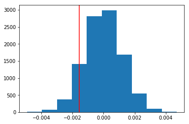

## Analyze A/B Test Results


## Table of Contents
- [Introduction](#intro)
- [Part I - Probability](#probability)
- [Part II - A/B Test](#ab_test)
- [Part III - Regression](#regression)


<a id='intro'></a>
### Introduction

A/B tests are very commonly performed by data analysts and data scientists.  It is important that you get some practice working with the difficulties of these 

For this project, you will be working to understand the results of an A/B test run by an e-commerce website.  Your goal is to work through this notebook to help the company understand if they should implement the new page, keep the old page, or perhaps run the experiment longer to make their decision.

**As you work through this notebook, follow along in the classroom and answer the corresponding quiz questions associated with each question.** The labels for each classroom concept are provided for each question.  This will assure you are on the right track as you work through the project, and you can feel more confident in your final submission meeting the criteria.  As a final check, assure you meet all the criteria on the [RUBRIC](https://review.udacity.com/#!/projects/37e27304-ad47-4eb0-a1ab-8c12f60e43d0/rubric).

<a id='probability'></a>
#### Part I - Probability

To get started, let's import our libraries.


```python
import pandas as pd
import numpy as np
import random
import matplotlib.pyplot as plt
%matplotlib inline
import statsmodels.api as sm

#We are setting the seed to assure you get the same answers on quizzes as we set up
random.seed(42)
```

    /opt/conda/lib/python3.6/site-packages/statsmodels/compat/pandas.py:56: FutureWarning: The pandas.core.datetools module is deprecated and will be removed in a future version. Please use the pandas.tseries module instead.
      from pandas.core import datetools
    

`1.` Now, read in the `ab_data.csv` data. Store it in `df`.  **Use your dataframe to answer the questions in Quiz 1 of the classroom.**

a. Read in the dataset and take a look at the top few rows here:


```python
df = pd.read_csv('ab_data.csv')
```

b. Use the cell below to find the number of rows in the dataset.


```python
df.shape[0]
```


    294478


c. The number of unique users in the dataset.


```python
df.user_id.nunique()
```


    290584


d. The proportion of users converted.


```python
df.converted.mean()
```


    0.11965919355605512


e. The number of times the `new_page` and `treatment` don't match.


```python
df.query('group == "treatment" & landing_page == "old_page"')['user_id'].shape[0]  + df.query('group == "control" & landing_page == "new_page"')['user_id'].shape[0]
```


    3893


f. Do any of the rows have missing values?


```python
df.info()
```

    <class 'pandas.core.frame.DataFrame'>
    RangeIndex: 294478 entries, 0 to 294477
    Data columns (total 5 columns):
    user_id         294478 non-null int64
    timestamp       294478 non-null object
    group           294478 non-null object
    landing_page    294478 non-null object
    converted       294478 non-null int64
    dtypes: int64(2), object(3)
    memory usage: 11.2+ MB
    

`2.` For the rows where **treatment** does not match with **new_page** or **control** does not match with **old_page**, we cannot be sure if this row truly received the new or old page.  Use **Quiz 2** in the classroom to figure out how we should handle these rows.  

a. Now use the answer to the quiz to create a new dataset that meets the specifications from the quiz.  Store your new dataframe in **df2**.


```python
df2 = df[((df['group'] == 'treatment') == (df['landing_page'] == 'new_page')) == True]
```


```python
# Double Check all of the correct rows were removed - this should be 0
df2[((df2['group'] == 'treatment') == (df2['landing_page'] == 'new_page')) == False].shape[0]
```


    0


`3.` Use **df2** and the cells below to answer questions for **Quiz3** in the classroom.

a. How many unique **user_id**s are in **df2**?


```python
df2.user_id.nunique()
```


    290584


b. There is one **user_id** repeated in **df2**.  What is it?


```python
df2[df2['user_id'].duplicated() == True]
```


<div>
<style scoped>
    .dataframe tbody tr th:only-of-type {
        vertical-align: middle;
    }

    .dataframe tbody tr th {
        vertical-align: top;
    }

    .dataframe thead th {
        text-align: right;
    }
</style>
<table border="1" class="dataframe">
  <thead>
    <tr style="text-align: right;">
      <th></th>
      <th>user_id</th>
      <th>timestamp</th>
      <th>group</th>
      <th>landing_page</th>
      <th>converted</th>
    </tr>
  </thead>
  <tbody>
    <tr>
      <th>2893</th>
      <td>773192</td>
      <td>2017-01-14 02:55:59.590927</td>
      <td>treatment</td>
      <td>new_page</td>
      <td>0</td>
    </tr>
  </tbody>
</table>
</div>


c. What is the row information for the repeat **user_id**? 


```python
df2[df2['user_id'] == 773192]
```


<div>
<style scoped>
    .dataframe tbody tr th:only-of-type {
        vertical-align: middle;
    }

    .dataframe tbody tr th {
        vertical-align: top;
    }

    .dataframe thead th {
        text-align: right;
    }
</style>
<table border="1" class="dataframe">
  <thead>
    <tr style="text-align: right;">
      <th></th>
      <th>user_id</th>
      <th>timestamp</th>
      <th>group</th>
      <th>landing_page</th>
      <th>converted</th>
    </tr>
  </thead>
  <tbody>
    <tr>
      <th>1899</th>
      <td>773192</td>
      <td>2017-01-09 05:37:58.781806</td>
      <td>treatment</td>
      <td>new_page</td>
      <td>0</td>
    </tr>
    <tr>
      <th>2893</th>
      <td>773192</td>
      <td>2017-01-14 02:55:59.590927</td>
      <td>treatment</td>
      <td>new_page</td>
      <td>0</td>
    </tr>
  </tbody>
</table>
</div>


d. Remove **one** of the rows with a duplicate **user_id**, but keep your dataframe as **df2**.


```python
df2 = df2.drop([2893])
```


```python
df2[df2['user_id'] == 773192]
```


<div>
<style scoped>
    .dataframe tbody tr th:only-of-type {
        vertical-align: middle;
    }

    .dataframe tbody tr th {
        vertical-align: top;
    }

    .dataframe thead th {
        text-align: right;
    }
</style>
<table border="1" class="dataframe">
  <thead>
    <tr style="text-align: right;">
      <th></th>
      <th>user_id</th>
      <th>timestamp</th>
      <th>group</th>
      <th>landing_page</th>
      <th>converted</th>
    </tr>
  </thead>
  <tbody>
    <tr>
      <th>1899</th>
      <td>773192</td>
      <td>2017-01-09 05:37:58.781806</td>
      <td>treatment</td>
      <td>new_page</td>
      <td>0</td>
    </tr>
  </tbody>
</table>
</div>


`4.` Use **df2** in the cells below to answer the quiz questions related to **Quiz 4** in the classroom.

a. What is the probability of an individual converting regardless of the page they receive?


```python
df2.converted.mean()
```


    0.11959708724499628


b. Given that an individual was in the `control` group, what is the probability they converted?


```python
df2[df2['group'] == "control"]['converted'].mean()
```


    0.1203863045004612


c. Given that an individual was in the `treatment` group, what is the probability they converted?


```python
df2[df2['group'] == "treatment"]['converted'].mean()
```


    0.11880806551510564


```python
#Computing observed difference in converted rates

obs_diff = df2[df2['group'] == "treatment"]['converted'].mean() - df2[df2['group'] == "control"]['converted'].mean()

# Display observed difference in converted rates
obs_diff
```


    -0.0015782389853555567


d. What is the probability that an individual received the new page?


```python
df2.query('landing_page == "new_page"').shape[0]/df2.shape[0]
```


    0.5000619442226688


e. Consider your results from parts (a) through (d) above, and explain below whether you think there is sufficient evidence to conclude that the new treatment page leads to more conversions.

**Answer :**<br>
>Based on the above results, I do not think there is a sufficient evidence to conclude that the new treatment page leads to more conversions. The reasons are as follows. <br>
>1) The probability of converted for control group is 0.1204 and the one for treatment group is 0.1188 shows that the probability of converted for both group is about 12%. This fiding is not practically significant to conclude either page is better than the other in terms of the conversion rate.  
>2) Observed difference in converted rates shows that the conversion rate for the control group is 0.0016 point greater than the one for treatment group. However, we still need to test if this results is not by chance. Also we need to compute p-values under the null hypothesis to investigate if the new treatment page leads to more conversions or not.     

<a id='ab_test'></a>
### Part II - A/B Test

Notice that because of the time stamp associated with each event, you could technically run a hypothesis test continuously as each observation was observed.  

However, then the hard question is do you stop as soon as one page is considered significantly better than another or does it need to happen consistently for a certain amount of time?  How long do you run to render a decision that neither page is better than another?  

These questions are the difficult parts associated with A/B tests in general.  


`1.` For now, consider you need to make the decision just based on all the data provided.  If you want to assume that the old page is better unless the new page proves to be definitely better at a Type I error rate of 5%, what should your null and alternative hypotheses be?  You can state your hypothesis in terms of words or in terms of **$p_{old}$** and **$p_{new}$**, which are the converted rates for the old and new pages.

$H_0 :$ $p_{old}$ is greater than or equal to $p_{new}$<br>
$H_1 :$ $p_{new}$ is greater than $p_{old}$

`2.` Assume under the null hypothesis, $p_{new}$ and $p_{old}$ both have "true" success rates equal to the **converted** success rate regardless of page - that is $p_{new}$ and $p_{old}$ are equal. Furthermore, assume they are equal to the **converted** rate in **ab_data.csv** regardless of the page. <br><br>

Use a sample size for each page equal to the ones in **ab_data.csv**.  <br><br>

Perform the sampling distribution for the difference in **converted** between the two pages over 10,000 iterations of calculating an estimate from the null.  <br><br>

Use the cells below to provide the necessary parts of this simulation.  If this doesn't make complete sense right now, don't worry - you are going to work through the problems below to complete this problem.  You can use **Quiz 5** in the classroom to make sure you are on the right track.<br><br>

a. What is the **conversion rate** for $p_{new}$ under the null? 


```python
p_new = df2['converted'].mean()
p_new
```


    0.11959708724499628


b. What is the **conversion rate** for $p_{old}$ under the null? <br><br>


```python
p_old = df2['converted'].mean()
p_old
```


    0.11959708724499628


c. What is $n_{new}$, the number of individuals in the treatment group?


```python
n_new = df2[df2['group'] == "treatment"].shape[0]
n_new
```


    145310


d. What is $n_{old}$, the number of individuals in the control group?


```python
n_old = df2[df2['group'] == "control"].shape[0]
n_old
```


    145274


e. Simulate $n_{new}$ transactions with a conversion rate of $p_{new}$ under the null.  Store these $n_{new}$ 1's and 0's in **new_page_converted**.


```python
new_page_converted = np.random.binomial(n_new, p_new)/n_new
```

f. Simulate $n_{old}$ transactions with a conversion rate of $p_{old}$ under the null.  Store these $n_{old}$ 1's and 0's in **old_page_converted**.


```python
old_page_converted = np.random.binomial(n_old, p_old)/n_old
```

g. Find $p_{new}$ - $p_{old}$ for your simulated values from part (e) and (f).


```python
new_page_converted - old_page_converted
```


    -0.001323554671471383


h. Create 10,000 $p_{new}$ - $p_{old}$ values using the same simulation process you used in parts (a) through (g) above. Store all 10,000 values in a NumPy array called **p_diffs**.


```python
p_diffs = []
for _ in range(10000):
    new_page_converted = np.random.binomial(n_new, p_new)/n_new
    old_page_converted = np.random.binomial(n_old, p_old)/n_old
    p_diffs.append(new_page_converted - old_page_converted)
```

i. Plot a histogram of the **p_diffs**.  Does this plot look like what you expected?  Use the matching problem in the classroom to assure you fully understand what was computed here.


```python
plt.hist(p_diffs);
plt.axvline(x=obs_diff, color='r');
```





j. What proportion of the **p_diffs** are greater than the actual difference observed in **ab_data.csv**?


```python
(np.array(p_diffs) > obs_diff).mean()
```


    0.90349999999999997


k. Please explain using the vocabulary you've learned in this course what you just computed in part **j.**  What is this value called in scientific studies?  What does this value mean in terms of whether or not there is a difference between the new and old pages?

**Answer:**<br>
>P-value computed in step j shows that probability of observing our statistics under the null hypothesis is 0.8997. By comparing our p-value to our type I error threshold ($\alpha = 0.05 $), we fail to reject the null hypothesis, meaning there is no statistically significant difference between the new and old pages.

l. We could also use a built-in to achieve similar results.  Though using the built-in might be easier to code, the above portions are a walkthrough of the ideas that are critical to correctly thinking about statistical significance. Fill in the below to calculate the number of conversions for each page, as well as the number of individuals who received each page. Let `n_old` and `n_new` refer the the number of rows associated with the old page and new pages, respectively.


```python
df2[df2['group'] == "control"]['converted'].mean()
```


    0.1203863045004612


```python
import statsmodels.api as sm

convert_old = sum((df2.group == 'control') & (df2.converted == 1))
convert_new = sum((df2.group == 'treatment') & (df2.converted == 1)) 

n_old = sum(df2.group == 'control') 
n_new = sum(df2.group == 'treatment')
```

m. Now use `stats.proportions_ztest` to compute your test statistic and p-value.  [Here](http://knowledgetack.com/python/statsmodels/proportions_ztest/) is a helpful link on using the built in.


```python
z_score, p_value = sm.stats.proportions_ztest([convert_new, convert_old], [n_new, n_old], alternative='larger') 
z_score, p_value
```


    (-1.3109241984234394, 0.90505831275902449)


n. What do the z-score and p-value you computed in the previous question mean for the conversion rates of the old and new pages?  Do they agree with the findings in parts **j.** and **k.**?

**Answer:**<br>
>A Z-test is a hypothesis test based on the Z-statistic following the standard normal distribution under the null hypothesis. The z-score of -1.3109 means that the test statistics is 1.3109 standard deviations below the mean and p-value of 0.9051 (90%) shows that 90% are in favor of the null hypothesis. The Z-test shows that there is no statistically significant difference in the conversion rates of the old and new pages and it agrees with the finding in our test results in parts j. and k. 

<a id='regression'></a>
### Part III - A regression approach

`1.` In this final part, you will see that the result you achieved in the A/B test in Part II above can also be achieved by performing regression.<br><br> 

a. Since each row is either a conversion or no conversion, what type of regression should you be performing in this case?

**Answer:**<br>
>Logistic Regression

b. The goal is to use **statsmodels** to fit the regression model you specified in part **a.** to see if there is a significant difference in conversion based on which page a customer receives. However, you first need to create in df2 a column for the intercept, and create a dummy variable column for which page each user received.  Add an **intercept** column, as well as an **ab_page** column, which is 1 when an individual receives the **treatment** and 0 if **control**.


```python
df2['intercept'] = 1
```


```python
df2[['ab_page_drop', 'ab_page']] = pd.get_dummies(df2['group'])
```


```python
df2 = df2.drop('ab_page_drop', axis=1)
```


```python
df2.head()
```


<div>
<style scoped>
    .dataframe tbody tr th:only-of-type {
        vertical-align: middle;
    }

    .dataframe tbody tr th {
        vertical-align: top;
    }

    .dataframe thead th {
        text-align: right;
    }
</style>
<table border="1" class="dataframe">
  <thead>
    <tr style="text-align: right;">
      <th></th>
      <th>user_id</th>
      <th>timestamp</th>
      <th>group</th>
      <th>landing_page</th>
      <th>converted</th>
      <th>intercept</th>
      <th>ab_page</th>
    </tr>
  </thead>
  <tbody>
    <tr>
      <th>0</th>
      <td>851104</td>
      <td>2017-01-21 22:11:48.556739</td>
      <td>control</td>
      <td>old_page</td>
      <td>0</td>
      <td>1</td>
      <td>0</td>
    </tr>
    <tr>
      <th>1</th>
      <td>804228</td>
      <td>2017-01-12 08:01:45.159739</td>
      <td>control</td>
      <td>old_page</td>
      <td>0</td>
      <td>1</td>
      <td>0</td>
    </tr>
    <tr>
      <th>2</th>
      <td>661590</td>
      <td>2017-01-11 16:55:06.154213</td>
      <td>treatment</td>
      <td>new_page</td>
      <td>0</td>
      <td>1</td>
      <td>1</td>
    </tr>
    <tr>
      <th>3</th>
      <td>853541</td>
      <td>2017-01-08 18:28:03.143765</td>
      <td>treatment</td>
      <td>new_page</td>
      <td>0</td>
      <td>1</td>
      <td>1</td>
    </tr>
    <tr>
      <th>4</th>
      <td>864975</td>
      <td>2017-01-21 01:52:26.210827</td>
      <td>control</td>
      <td>old_page</td>
      <td>1</td>
      <td>1</td>
      <td>0</td>
    </tr>
  </tbody>
</table>
</div>


c. Use **statsmodels** to instantiate your regression model on the two columns you created in part b., then fit the model using the two columns you created in part **b.** to predict whether or not an individual converts. 


```python
logit_mod = sm.Logit(df2['converted'], df2[['intercept', 'ab_page']])
results1 = logit_mod.fit()
```

    Optimization terminated successfully.
             Current function value: 0.366118
             Iterations 6
    

d. Provide the summary of your model below, and use it as necessary to answer the following questions.


```python
results1.summary()
```


<table class="simpletable">
<caption>Logit Regression Results</caption>
<tr>
  <th>Dep. Variable:</th>     <td>converted</td>    <th>  No. Observations:  </th>   <td>290584</td>   
</tr>
<tr>
  <th>Model:</th>               <td>Logit</td>      <th>  Df Residuals:      </th>   <td>290582</td>   
</tr>
<tr>
  <th>Method:</th>               <td>MLE</td>       <th>  Df Model:          </th>   <td>     1</td>   
</tr>
<tr>
  <th>Date:</th>          <td>Fri, 29 Mar 2019</td> <th>  Pseudo R-squ.:     </th>  <td>8.077e-06</td> 
</tr>
<tr>
  <th>Time:</th>              <td>20:20:56</td>     <th>  Log-Likelihood:    </th> <td>-1.0639e+05</td>
</tr>
<tr>
  <th>converged:</th>           <td>True</td>       <th>  LL-Null:           </th> <td>-1.0639e+05</td>
</tr>
<tr>
  <th> </th>                      <td> </td>        <th>  LLR p-value:       </th>   <td>0.1899</td>   
</tr>
</table>
<table class="simpletable">
<tr>
      <td></td>         <th>coef</th>     <th>std err</th>      <th>z</th>      <th>P>|z|</th>  <th>[0.025</th>    <th>0.975]</th>  
</tr>
<tr>
  <th>intercept</th> <td>   -1.9888</td> <td>    0.008</td> <td> -246.669</td> <td> 0.000</td> <td>   -2.005</td> <td>   -1.973</td>
</tr>
<tr>
  <th>ab_page</th>   <td>   -0.0150</td> <td>    0.011</td> <td>   -1.311</td> <td> 0.190</td> <td>   -0.037</td> <td>    0.007</td>
</tr>
</table>


```python
#exponentiate the results
np.exp(results1.params)
```


    intercept    0.136863
    ab_page      0.985123
    dtype: float64


e. What is the p-value associated with **ab_page**? Why does it differ from the value you found in **Part II**?<br><br>  **Hint**: What are the null and alternative hypotheses associated with your regression model, and how do they compare to the null and alternative hypotheses in **Part II**?

**Answer:**<br>
>The p-value associated with ab_page is 0.190. It differs from the p-value I have found in Z-test in Part II because this logistic regression model is two-tailed test, whereas Z-test is one-tailed test. 
>
>With two-tailed test the null and alternative hypotheses are <br>
$H_0:$ The coefficient of ab_page is equals to 0.<br>
$H_1:$ The coefficient of ab_page is not equals to 0. <br>
>
>With one-tailed test the null and alternative hypotheses are <br>
$H_0 :$ $p_{old}$ is greater than or equal to $p_{new}$<br>
$H_1 :$ $p_{new}$ is greater than $p_{old}$
>
>And because the alternative hypothesis in two-tailed test has two-sided alternatives as follows, we can compute a p-value of one-tailed test from two-tailed output depending on the direction of the one-tailed hyphothesis. <br>
>
>a) the coefficient of ab_page is less than 0 <br>
p-value of one-tailed test is 0.5*(two-tailed p-value)<br>
>
>b) the coefficient of ab_page is greater than 0 <br>
1-0.5*(two-tailed p-value)<br>
>
>Since alternative hypothesis in Z-test is $p_{new}$ - $p_{old}$ > 0, the p-value calculated from two-tailed p-value is 1-0.5*(0.190) = 0.905,  which is the value I have found in Part II. 

>**Reference**<br>
I have refered to [this link][1] to compute the p-value.

[1]: https://stats.idre.ucla.edu/other/mult-pkg/faq/general/faq-what-are-the-differences-between-one-tailed-and-two-tailed-tests/ "FAQ: What are the differences between one-tailed and two-tailed tests?"

**Note : Interpretting the test results**

>Coefficient of ab_page<br>
The coefficient of ab_page is 0.99 meaning the conversion is 0.99 times as likely if the individuals receive the new page. 

f. Now, you are considering other things that might influence whether or not an individual converts.  Discuss why it is a good idea to consider other factors to add into your regression model.  Are there any disadvantages to adding additional terms into your regression model?

**Answer :**<br>
>It is a good idea to consider other factors to add into the regression model because web-page itself might not be the only factors for the individuals to decide whether or not they would like to purchase the company's products. In the logistic regression model, the coefficient of one variable is not influenced by the coefficient of another variable, so I can predict the relative influence of one or more variables without interactions. 
>
>A multiple regression model may lead to the faulty conclusions especially when the sample size is not large enough, however, the data size being used in this test has sufficiently large enough so, I do not think there is a disdvantage to add additional variables to the logistic regression model.


g. Now along with testing if the conversion rate changes for different pages, also add an effect based on which country a user lives in. You will need to read in the **countries.csv** dataset and merge together your datasets on the appropriate rows.  [Here](https://pandas.pydata.org/pandas-docs/stable/generated/pandas.DataFrame.join.html) are the docs for joining tables. 

Does it appear that country had an impact on conversion?  Don't forget to create dummy variables for these country columns - **Hint: You will need two columns for the three dummy variables.** Provide the statistical output as well as a written response to answer this question.


```python
country = pd.read_csv('countries.csv')
```


```python
df2 = df2.join(country.set_index('user_id'), on='user_id')
```


```python
df2[['CA', 'UK', 'US']] = pd.get_dummies(df2['country'])
```


```python
logit_mod = sm.Logit(df2['converted'], df2[['intercept', 'US', 'UK']])
results2 = logit_mod.fit()
results2.summary()
```

    Optimization terminated successfully.
             Current function value: 0.366116
             Iterations 6
    


<table class="simpletable">
<caption>Logit Regression Results</caption>
<tr>
  <th>Dep. Variable:</th>     <td>converted</td>    <th>  No. Observations:  </th>   <td>290584</td>   
</tr>
<tr>
  <th>Model:</th>               <td>Logit</td>      <th>  Df Residuals:      </th>   <td>290581</td>   
</tr>
<tr>
  <th>Method:</th>               <td>MLE</td>       <th>  Df Model:          </th>   <td>     2</td>   
</tr>
<tr>
  <th>Date:</th>          <td>Fri, 29 Mar 2019</td> <th>  Pseudo R-squ.:     </th>  <td>1.521e-05</td> 
</tr>
<tr>
  <th>Time:</th>              <td>21:19:37</td>     <th>  Log-Likelihood:    </th> <td>-1.0639e+05</td>
</tr>
<tr>
  <th>converged:</th>           <td>True</td>       <th>  LL-Null:           </th> <td>-1.0639e+05</td>
</tr>
<tr>
  <th> </th>                      <td> </td>        <th>  LLR p-value:       </th>   <td>0.1984</td>   
</tr>
</table>
<table class="simpletable">
<tr>
      <td></td>         <th>coef</th>     <th>std err</th>      <th>z</th>      <th>P>|z|</th>  <th>[0.025</th>    <th>0.975]</th>  
</tr>
<tr>
  <th>intercept</th> <td>   -2.0375</td> <td>    0.026</td> <td>  -78.364</td> <td> 0.000</td> <td>   -2.088</td> <td>   -1.987</td>
</tr>
<tr>
  <th>US</th>        <td>    0.0408</td> <td>    0.027</td> <td>    1.518</td> <td> 0.129</td> <td>   -0.012</td> <td>    0.093</td>
</tr>
<tr>
  <th>UK</th>        <td>    0.0507</td> <td>    0.028</td> <td>    1.786</td> <td> 0.074</td> <td>   -0.005</td> <td>    0.106</td>
</tr>
</table>


```python
np.exp(results2.params)
```


    intercept    0.130350
    US           1.041647
    UK           1.052027
    dtype: float64


**Note : Interpretting the test results**

>Coefficient of country<br>
Conversion is 1.04 times as likely if the individuals are in US and 1.05 in UK. 

h. Though you have now looked at the individual factors of country and page on conversion, we would now like to look at an interaction between page and country to see if there significant effects on conversion.  Create the necessary additional columns, and fit the new model.  

Provide the summary results, and your conclusions based on the results.


```python
logit_mod = sm.Logit(df2['converted'], df2[['intercept', 'ab_page', 'US', 'UK']])
results3 = logit_mod.fit()
results3.summary()
```

    Optimization terminated successfully.
             Current function value: 0.366113
             Iterations 6
    


<table class="simpletable">
<caption>Logit Regression Results</caption>
<tr>
  <th>Dep. Variable:</th>     <td>converted</td>    <th>  No. Observations:  </th>   <td>290584</td>   
</tr>
<tr>
  <th>Model:</th>               <td>Logit</td>      <th>  Df Residuals:      </th>   <td>290580</td>   
</tr>
<tr>
  <th>Method:</th>               <td>MLE</td>       <th>  Df Model:          </th>   <td>     3</td>   
</tr>
<tr>
  <th>Date:</th>          <td>Fri, 29 Mar 2019</td> <th>  Pseudo R-squ.:     </th>  <td>2.323e-05</td> 
</tr>
<tr>
  <th>Time:</th>              <td>21:25:52</td>     <th>  Log-Likelihood:    </th> <td>-1.0639e+05</td>
</tr>
<tr>
  <th>converged:</th>           <td>True</td>       <th>  LL-Null:           </th> <td>-1.0639e+05</td>
</tr>
<tr>
  <th> </th>                      <td> </td>        <th>  LLR p-value:       </th>   <td>0.1760</td>   
</tr>
</table>
<table class="simpletable">
<tr>
      <td></td>         <th>coef</th>     <th>std err</th>      <th>z</th>      <th>P>|z|</th>  <th>[0.025</th>    <th>0.975]</th>  
</tr>
<tr>
  <th>intercept</th> <td>   -2.0300</td> <td>    0.027</td> <td>  -76.249</td> <td> 0.000</td> <td>   -2.082</td> <td>   -1.978</td>
</tr>
<tr>
  <th>ab_page</th>   <td>   -0.0149</td> <td>    0.011</td> <td>   -1.307</td> <td> 0.191</td> <td>   -0.037</td> <td>    0.007</td>
</tr>
<tr>
  <th>US</th>        <td>    0.0408</td> <td>    0.027</td> <td>    1.516</td> <td> 0.130</td> <td>   -0.012</td> <td>    0.093</td>
</tr>
<tr>
  <th>UK</th>        <td>    0.0506</td> <td>    0.028</td> <td>    1.784</td> <td> 0.074</td> <td>   -0.005</td> <td>    0.106</td>
</tr>
</table>


```python
np.exp(results3.params)
```


    intercept    0.131332
    ab_page      0.985168
    US           1.041599
    UK           1.051944
    dtype: float64


**Conclusion : Interpretting the results** <br>
>First, I cannot predict any interaction between each variables in this model. In the above logistic regression model, there is no interaction term used, so each estimated coefficient is the expected change in the log odds of converting to new page for a unit increase in the corresponding predictor variable(ab_page, US or UK), holding the other variables constant.<br> 
>
>Second, although we have added country variables in addition to ap_page, coefficient for thoes explanatory variables does not seem to be significant.
- Conversion is 0.99 times as likely if the individuals receive the new page. 
- Conversion is 1.04 times as likely if the individuals are in US and 1.05 in UK.<br> 
>From this predition, I conclude that there is no significant difference in old page and new page.
>
>Lastly, based on the above findings, I would conclude there is no statistically or practically significant difference between new page and old page.    


```python
from subprocess import call
call(['python', '-m', 'nbconvert', 'Analyze_ab_test_results_notebook.ipynb'])
```


    0


