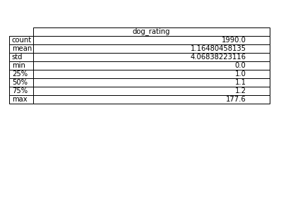
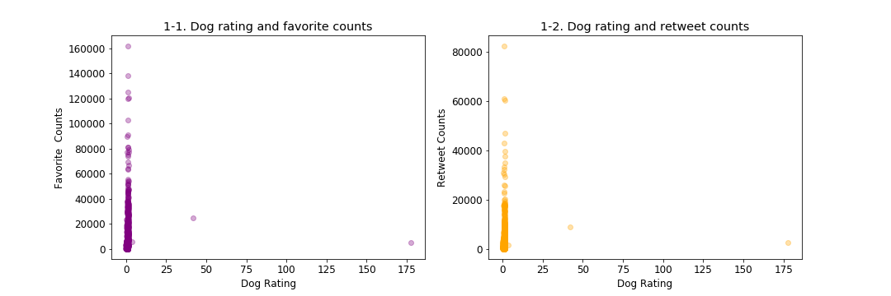
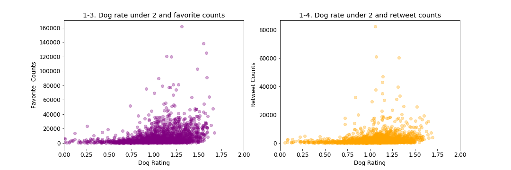
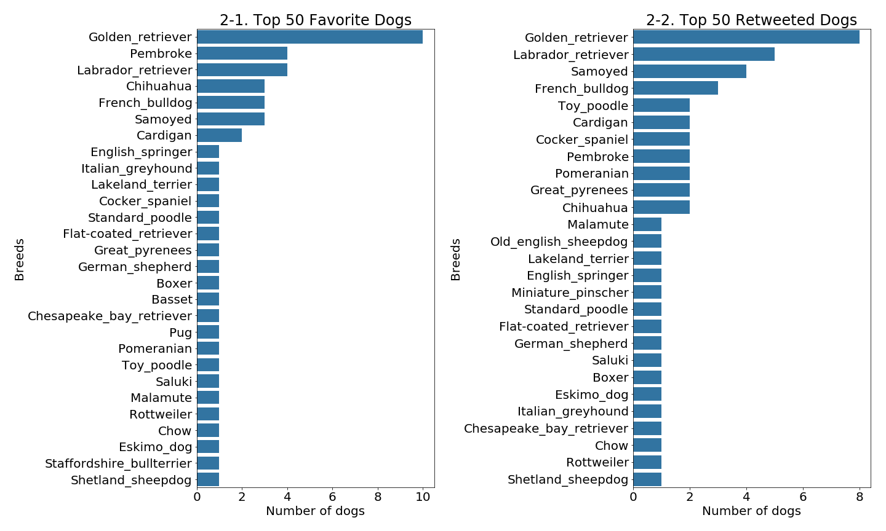
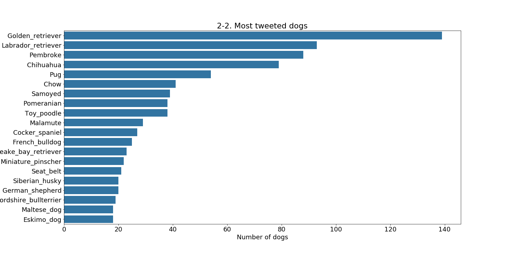
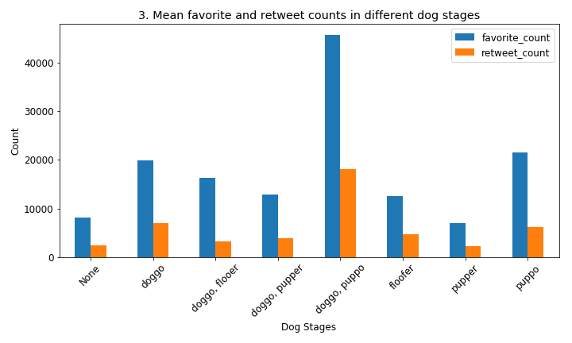

# WeRateDogs Data Wrangling Project 

## Introduction

**[WeRateDogs](https://twitter.com/dog_rates)** is a Twitter account that rates people's dogs with humorous commnet about dogs. In my data wrangling project, I have collected the twitter archive of WeRateDogs and wrangled the data set. To analyze each tweet, I have also collected the image predictions file (Image predictions that are made through a neural network which classify the breeds of dogs) and twitter data that I have gathered from WeRateDogs with Twitter API.

**Data beeing used:**
- Twitter archive
- Image Prediction Files 
- Twitter Data 

The original data is prepared through `wrangle_act.ipynb`. Wrangling act overview is provided in `wragle_report.html`. 

**Questions**
1. Does the dog's rating have positive effect on retweet or favorite counts? By comparing the dogs with higher rating and the retweet and favorite counts of the tweet, analyse if dog ratings has strong corelation with favorite counts and retweet counts. 
2. Which types of dogs are rated higher? Is there any tendecy that some types of dogs are rated higher? Also, which type of dogs are tweeted most.  
3. Which stage of dogs are receiving more favorite counts and retweet counts ?


```python
from IPython.display import Image
```

## Analysis

### 1. Does the dog's rating have positive effect on retweet or favorite counts? By comparing the dogs with higher rating and the retweet and favorite counts of the tweet, analyse if dog ratings has strong corelation with favorite counts and retweet counts. 

WeRateDogs uses very unique rating system, meaning there is no upper limit for the maximun rating, so users can rate their dogs as high as they want. Over all, the average rating is 1.169 as described in the following table. We can also see that the maximum rate is 177.6. 


```python
Image('desc_plot.png')
```





If there is an either positive or negative corelation between dog ratings and favorite counts or retweet counts, we can find the tendency in the scatter plots. However, as we can see in the scatter plot charts below, it seems that most of the favorite or retweet counts falls under the average rating. Also the ratings vary from 0 to above 160,000 favorite counts and from 0 to above 80,000 retweet counts. We can also see that the max rating of 177.6 is outlier in the entire tweets. 


```python
Image('q1.png')
```





Since dog rating of 177.6 is an extream, I would like to focus more on the average dog ratings to see if there is any correlations with favorits counts or retweet counts. The following two scatter plot charts are limited to display the favorite counts or retweet counts with dog ratings under 2.0. Again, it does not show any strong correlations between dog ratings and favorite or retweet counts. Thus, I could not find a strong correltion between dog ratings and favorite or retweet counts.


```python
Image('q1_2.png')
```





### 2. Which types of dogs are rated higher? Is there any tendecy that some types of dogs are rated higher? Also, which type of dogs are tweeted most. 


The following bar charts displays the breeds of dogs which are receiving more favorites and being retweeted in WeRateDogs. As we can see in the charts, Golden Retriever ranked the first in both "Top 50 Favorite Dogs" and "Top 50 Retweeted Dogs" in WeRateDogs.


```python
Image('q2.png')
```





Also, Golden Retriever is the most tweeted dogs in WeRateDogs, too. <br>
However, in the data set, I have found that the tweets which has recieved the highest favorite counts is of Laborador Retriever. 

Based on `Most tweeted dog` bar chart, Labrador Retriever placed at the 2nd most tweeted dogs with a big differene from the 1st place. However, by looking at the favorite counts of the most favorited Laborador Retriever and the most favorited Golden Retriever, Labrador Retriver won going away with favorite counts of 162232 compared to the top Golden Retriever with favorite counts of 81051. 


```python
Image('q2_2.png')
```





```python
Image('q2_2.png')
```


```python
%%HTML
<p>This is the Laborador Retriever who is receiving the most favorite counts.</p>

```


<p>This is the Laborador Retriever who is receiving the most favorite counts.</p>


### 3. Which stage of dogs are receiving more favorite counts and retweet counts ?


Finally, I have focused on the dog stage and analysed the mean favorite counts and the mean retweet counts on each stage. The most favorited Laborador Retrever mentioned above is categorized as 'dogogo', by the way. 
Based on `3. Mean favorite and retweet counts in different dog stages` bar chart, the dog stages with doggo and puppo is receiving both favorite and retweet count. 


```python
Image('q3.png')
```





