# Effects of home environment on students' math literacy

**Table of contents**
- Overview
- Summary of Findings
- Key Insights for Presentation
- Presentation

# Overview
#### Investigation
In this analysis, I have investigated how the home environment has impacts over students' math literacy. I will focus on the following questions to find correlations and trends.  

##### Q1. How out-of-school study hours are important for increasing math literacy rates.

##### Q2.Types of out-side-school study which has the most impact over literacy rate.

##### Q3. How much influence does social environment have over literacy  or outside study hours.
Focusing on educational level of parents and family structure.  

##### Q4. How subjective norms in math have impact on literacy rates and out-of-school study hours.  

#### About a dataset
The OECD Programme for International Student Assessment (PISA) is an international assessment which aims to evaluate education systems worldwide by testing reading, mathematics and science literacy of 15-year-old students.
The original Pisa 2012 data consisted of 485,490 students records with 636 columns.The dataset can be found in the
udacity's resource [here](https://s3.amazonaws.com/udacity-hosted-downloads/ud507/pisa2012.csv.zip),
with feature documentation available [here](https://s3.amazonaws.com/udacity-hosted-downloads/ud507/pisadict2012.csv).


In my investigation I have selected the following variables. <br>
```
'CNT', 'ST35Q04', 'ST35Q05', 'ST35Q06', 'ST55Q01', 'ST55Q02', 'ST55Q03', 'ST55Q04', 'ST57Q01', 'ST57Q02',
'ST57Q03', 'ST57Q04', 'ST57Q05', 'ST57Q06', 'FAMSTRUC', 'HISCED', 'HISEI', 'IMMIG', 'LMINS','MMINS', 'SMINS', 'OUTHOURS',
'SUBNORM','PV1MATH', 'PV2MATH', 'PV3MATH', 'PV4MATH', 'PV5MATH', 'PV1READ', 'PV2READ', 'PV3READ', 'PV4READ', 'PV5READ',
'PV1SCIE', 'PV2SCIE', 'PV3SCIE', 'PV4SCIE', 'PV5SCIE'
```

# Summary of Findings
- Homework hours and math literacy
- Social environment impacts on math literacy and homework hours  
- Subjective norms relations with homework hours and math literacy across different social environment

##### Homework hours relations with math literacy

In the exploration, I found that amongst all type of out-of-school study methods, hours spend on their homework has a positive influence on math literacy.
It was surprising for me that when I first found out that out-of-school study hours do no have effects on math literacy. By separately plotting the out-of-school study in each method type against the math literacy, I could see how the relations between study hours and math literacy varies in each study method types. For example, hours of study with parents have negative impacts over students' math literacy and out-of-school math lesson hours does not seem to have influence over math literacy.

##### Social environment impacts on math literacy and homework hours  

In bivariate exploration, I found that there are similar trends in students' math literacy and homework hours across each social environment such as the highest educational level of parents or family structures of the students. The higher educational level the parents have, the higher math literacy rate or homework hours the students tend to have. And the students who live with both parents tend to have higher math literacy and longer homework hours. This findings also makes me wonder what factors motivate students to study more.

##### Subjective norms relations with homework hours and math literacy across different social environment

In multivariate exploration, I found that the subjective norms in math have influence over math literacy and homework hours in some degree. In this investigation, I wanted to see whether the parents' perception towards math; how import they think that math is important for education motivates students to study outside of school. For that, I needed to use 'ST35Q04' which is categorical variables for students' subjective norm in math "Parents Believe Studying Mathematics Is Important". Across different social environment, the students with higher subjective norms in math tends to have higher math literacy or homework hours.

# Key Insights for Presentation

For the presentation,  I start by introducing the distribution for vairbles of my interest which are math literacy variables, out-of-school hours variables, family structure and highest educational level of parents. Then plot the scatterplots to show the basic relations between numeric features.

Next, I introduce each of the categorical variables and displays the trends. I use boxplot of math literacy and homework hours across family structure, highest educational level of parents.

Then, I create heatmap to show the average math literacy and homework against two categorical features in order to show the actual data.

Finally, I create pointplot to displays the influence of subjective norms in math against math literacy or homework hours across each social environment. By using the pointplots it is clearly shows transition of average math literacy and homework hours for each subjective norms degree in math across social environment of students.

# Presentation
### Distribution of students' literacy rate
Students literacy rate in the dataset take on normally distributed values, from about 200 to about 800 at the highest with peak at around 500


```python

binsize = 30
bins = np.arange(0, pisa['MATH'].max()+binsize, binsize)

plt.hist(data = pisa, x = 'MATH', bins = bins)
plt.xlim(0,1100)
plt.title('Math literacy of students')
plt.xlabel('Math literacy score')
plt.ylabel('Number of students')

plt.tight_layout();
```


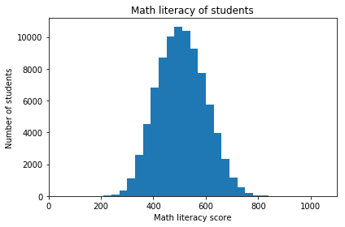


### Distribution of Out-of-school study hours
Out-side-school-study hours plots are all skewed to the right.
Most of the students spend their time on doing their homework and time spent has a long-tailed distribution with a peak on less than 5 hours.


```python
binsize = 1
bins = np.arange(0, 60+binsize, binsize)

plt.hist(data = pisa, x = 'OUTHOURS', bins = bins)
plt.title('Out-of-school study hours')
plt.ylabel('Number of students')
plt.xlabel('outhours per week');
```


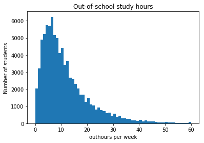


```python
plt.figure(figsize = [15,10])

binsize = 0.9
bins = np.arange(0, 30+binsize, binsize)


plt.subplot(2,3,1)
plt.hist(data = pisa, x = 'HOMEWORK', bins = bins)
plt.title('Homework hours')
plt.ylabel('Number of students')
plt.xlabel('Homework hours per week');

plt.subplot(2,3,2)
plt.hist(data = pisa, x = 'GUIDED_HOMEWORK', bins = bins)
plt.xlim(0,15)
plt.title('Guided homework hours')
plt.ylabel('Number of students')
plt.xlabel('Guided howork hours per week');


plt.subplot(2,3,3)
plt.hist(data = pisa, x = 'PERSONAL_TUTOR', bins = bins)
plt.xlim(0,15)
plt.title('Study hours with personal tutor')
plt.ylabel('Number of students')
plt.xlabel('Personal tutor hours per week');

plt.subplot(2,3,4)
plt.hist(data = pisa, x = 'COMMERCIAL_COMPANY', bins = bins)
plt.xlim(0,15)
plt.title('Study time spent in commercial company')
plt.ylabel('Number of students')
plt.xlabel('commercial company hours per week');

plt.subplot(2,3,5)
plt.hist(data = pisa, x = 'WITH_PARENT', bins = bins)
plt.xlim(0,15)
plt.title('Study time spent wih parents')
plt.ylabel('Number of students')
plt.xlabel('study-with-parents hours per week');

plt.subplot(2,3,6)
plt.hist(data = pisa, x = 'COMPUTER', bins = bins)
plt.xlim(0,15)
plt.title('Study with computer hours')
plt.ylabel('Number of students')
plt.xlabel('study hours using computer per week')
plt.tight_layout();
```


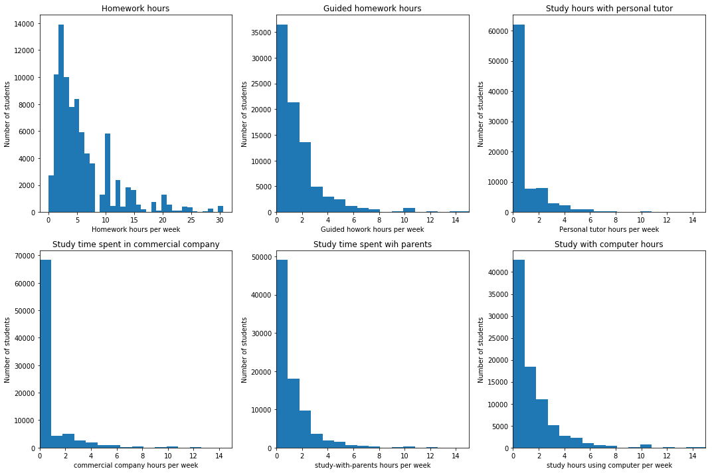


### Destributions of students' family structures and Highest educational level of thier parents
Most students live with their parents and most of the parents falls unde ISCED 5A or 6 which stands for theoretically oriented tertiary and post-graduate shool. <br>

Note:<br>
`ISCED 1`  : Primary education or first stage of basic education<br>
`ISCED 2`  : Lower secondary education or second stage of basic education<br>
`ISCED 3B,C` : Vocational/pre-vocational upper secondary<br>
`ISCED 3A` : General upper secondary<br>
`ISCED 4`  : Post-secondary non-tertiary education<br>
`ISCED 5B` : First stage of tertiary education <br>
`ISCED 5A, 6` : Second stage of tertiary education<br>


```python
ticks_label = ['Single parent', 'Two parents', 'Not with parents']
ticks = np.arange(3)

sb.countplot(data = pisa, x = 'FAMSTRUC', color = base_color)
plt.title('Family Structure')
plt.xticks(ticks, ticks_label, rotation=45)
plt.ylabel('Number of students')
plt.xlabel(None);
```


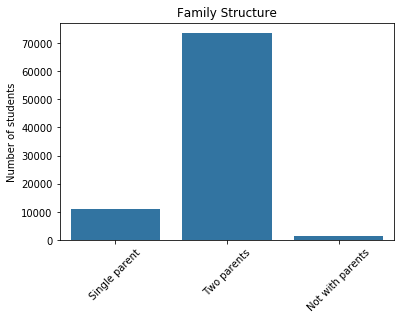


```python
base_color = sb.color_palette()[0]

sb.countplot(data = pisa, x = 'HISCED', color = base_color)
plt.title("Highest educational level of parents")
plt.xticks(rotation=45)
plt.ylabel('Number of students')
plt.xlabel(None);
```


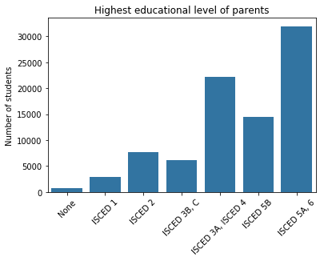


### Math literacy vs variables of interest (out-of-school study hours, homework hours and study hours with parents)

Out-of-school hours overall does not have any influence over how well students understand math. However, time spent on their homework has an positive liner relationship. It seems that the relations between study hours and math literacy varies in each method types.


```python
student_samp = pisa.sample(500)
```


```python
plt.figure(figsize = [15,10])

plt.subplot(1,3,1)
sb.regplot(data = student_samp, x = 'OUTHOURS', y = 'MATH',
          x_jitter = 0.2, y_jitter = 0.2, scatter_kws = {'alpha' : 1/3})
plt.ylim(145,860)
plt.title('Math literacy and out-of-school study hours')
plt.xlabel('Out-of-school study hours per week')
plt.ylabel('Math literacy score')

plt.subplot(1,3,2)
sb.regplot(data = student_samp, x = 'HOMEWORK', y = 'MATH',
          x_jitter = 0.2, y_jitter = 0.2, scatter_kws = {'alpha' : 1/3})
plt.ylim(145,860)
plt.title('Math literacy and homework hours')
plt.xlabel('homework hours per week')
plt.ylabel('Math literacy score')

plt.subplot(1,3,3)
sb.regplot(data = student_samp, x = 'WITH_PARENT', y = 'MATH',
          x_jitter = 0.2, y_jitter = 0.2, scatter_kws = {'alpha' : 1/3})
plt.ylim(145,860)
plt.title('Math literacy and study hours with parents')
plt.xlabel('study huors with parent per week')
plt.ylabel('Math literacy score')
plt.tight_layout();
```


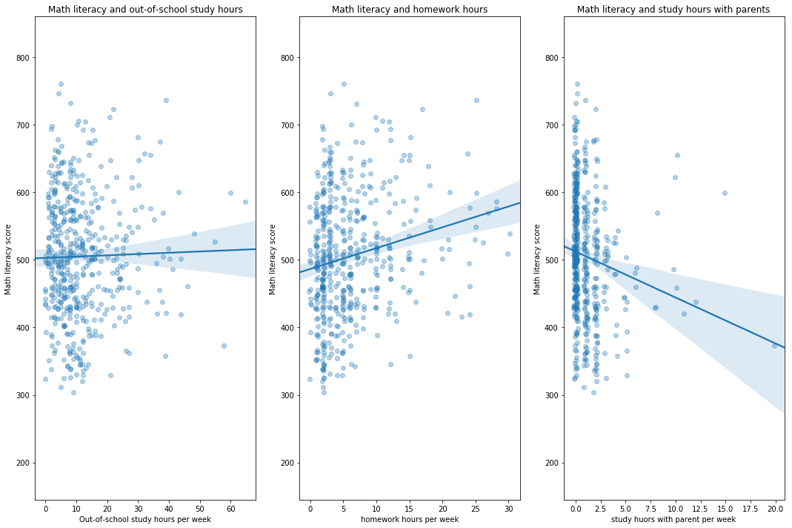


### Math literacy vs. out-of-school math lessons and homework hours

Surprisingly, out-of-school lessons in math does not have clear influece over math literacy. By comparing average math literacy of the students who spend more than 6 hours on math lessons and those who do not attend such lessons, the latter scored the similar literacy rate as the former. Rather we can clearly see that average and entire math literacy of students increase as they spend more time on the homework.


```python
plt.figure (figsize= [15,15])

plt.subplot(4,1,1)
sb.boxplot(data = pisa, x = 'MATH', y = 'MLESSON', color = base_color)
plt.title('Math literacy score and Math lesson hours')
plt.xlim(145,860)
plt.ylabel('Out-of-school math lesson hours')
plt.xlabel('Math literacy score')

plt.subplot(4,1,2)
sb.boxplot(data = pisa, x = 'MATH', y = 'HWHOURS', color = base_color)
plt.title('Math literacy score and homework hours')
plt.xlim(145,860)
plt.ylabel('homework hours')
plt.xlabel('Math literacy score')

plt.tight_layout();
```


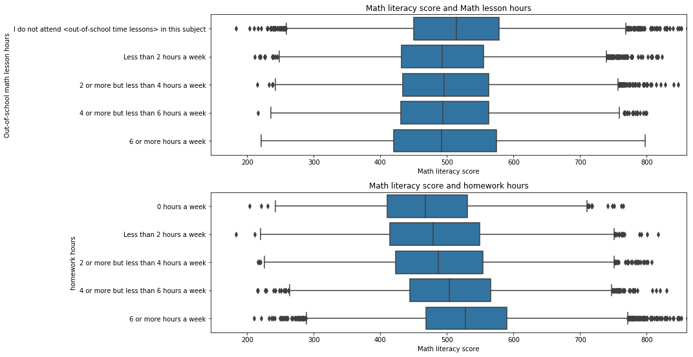


### Math literacy vs. family structure.

We can see that clear drop in math literacy of those stuents who does not live with their parents. Although the math literacy rate shows significant difference, the time spend on homework does not differ too much.


```python
plt.figure(figsize = [10,5])
base_color = sb.color_palette()[0]

ticks_label = ['Single parent', 'Two parents', 'Not with parents']
ticks = np.arange(3)

plt.subplot(1,2,1)
sb.boxplot(data = pisa, x = 'FAMSTRUC',  y = 'MATH',color = base_color)
plt.title('Math literacy score and family structure');
plt.ylabel('Math literacy')
plt.xticks(ticks, ticks_label, rotation=45)
plt.xlabel(None)
plt.ylim(145,860)

plt.subplot(1,2,2)
sb.boxplot(data = pisa, x = 'FAMSTRUC',  y = 'HOMEWORK', color = base_color)
plt.title('Homework hours and family structure');
plt.ylabel('Math literacy')
plt.xticks(ticks, ticks_label, rotation=45)
plt.ylim(0,35)
plt.xlabel(None);

```


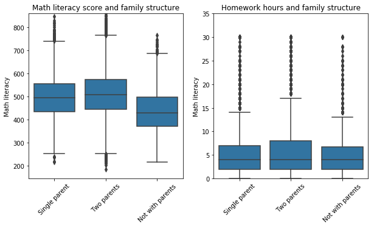


### Math literacy vs. highest educational level of parents.

Educational level of parents seems to have some sort of influence over the students' math literacy. Students who have parents with higher education seems to do well in math.  


```python
plt.figure(figsize = [8,10])
base_color = sb.color_palette()[0]

plt.subplot(2,1,1)
sb.boxplot(data = pisa, x = 'HISCED',  y = 'MATH',color = base_color)
plt.title("Math literacy and parents' educational level");
plt.ylabel('Math literacy')
plt.xlabel(None)
plt.xticks(rotation = 45)


plt.subplot(2,1,2)
sb.boxplot(data = pisa, x = 'HISCED',  y = 'HOMEWORK', color = base_color)
plt.title("homwork hours and parents' educational level");
plt.ylabel('Math literacy')
plt.xlabel(None)
plt.xticks(rotation = 45)
plt.ylim(0,35)

plt.tight_layout();
```


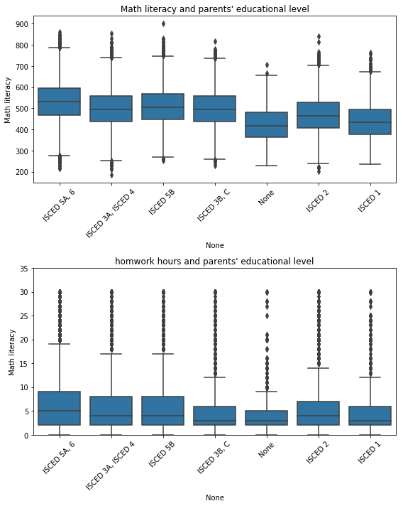


### Average math literacy and hour spent on homework by family structure for highest educational level of parents.

As we can easily imagine from the above observation, for those students who does not live with their parents, the average math literacy rate is lower; among those students, the lower the educational level of the parents are, the lower the average math literacy tends to be. Similar characteristics can be found in homework hours the students spend. Amongst family structure, students who live with two parents tend to have higher math literacy rate.   


```python
plt.figure(figsize = [20,8])

plt.subplot(1,2,1)
cat_means = pisa.groupby(['FAMSTRUC', 'HISCED']).mean()['MATH']
cat_means = cat_means.reset_index(name = 'MATH_avg')
cat_means = cat_means.pivot(index = 'HISCED', columns = 'FAMSTRUC',
                           values = 'MATH_avg')
ax =sb.heatmap(cat_means, annot = True, fmt = '.3f',
          cbar_kws = {'label' : 'mean(MATH)'})
ax.invert_yaxis()
plt.title("Average math literacy accross parents' educational level and family structure")
plt.ylabel('homework hours (ave)')
plt.xlabel(None)

plt.subplot(1,2,2)
cat_means = pisa.groupby(['FAMSTRUC', 'HISCED']).mean()['HOMEWORK']
cat_means = cat_means.reset_index(name = 'homework_avg')
cat_means = cat_means.pivot(index = 'HISCED', columns = 'FAMSTRUC',
                           values = 'homework_avg')
ax = sb.heatmap(cat_means, annot = True, fmt = '.3f',
          cbar_kws = {'label' : 'mean(HOMEWORK)'})
ax.invert_yaxis()
plt.title("Average homework hours accross parents' educational level and family structure")
plt.ylabel('homework hours (ave)')
plt.xlabel(None)


plt.tight_layout();
```


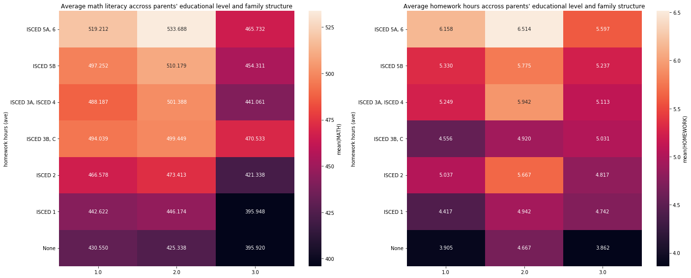


### Math literacy and homework hours by highest educational level of parents for subjective norms in math (parents believe studying math is important)

We can see how parents' belief in math encourage students to work on thier homework by plotting the average homework hours on highest educational level of parents. The higher the educational level of their parents have, the more the students spend time on homework. Within each level of parents' educational level, we can also observe an increse in homework hours on the parents' belief in math. As the parents more believe importance in math, the students spend more time on math.

As if to represent the correlation, the math literacy shows the similar characteristics: the higher the education their parents have, the more math literacy the students have. Within each level of parents' educational level, we can see an increse in literacy rate on the parents' belief in math.


```python
plt.figure(figsize = [20,5])

plt.subplot(1,2,1)
sb.pointplot(data = pisa, x = 'HISCED', y = 'MATH', hue = 'parents_math_importance' ,color = base_color)
plt.title("Average math literacy accross parents' educational level and belief in math")
plt.ylabel('Math literacy score (ave)')
plt.xlabel(None)
plt.xticks(rotation=45)

plt.subplot(1,2,2)
sb.pointplot(data = pisa, x = 'HISCED', y = 'HOMEWORK', hue = 'parents_math_importance' ,color = base_color)
plt.title("Average homework hours accross parents' educational level and belief in math")
plt.ylabel('homework hours (ave)')
plt.xlabel(None)
plt.xticks(rotation=45);
```


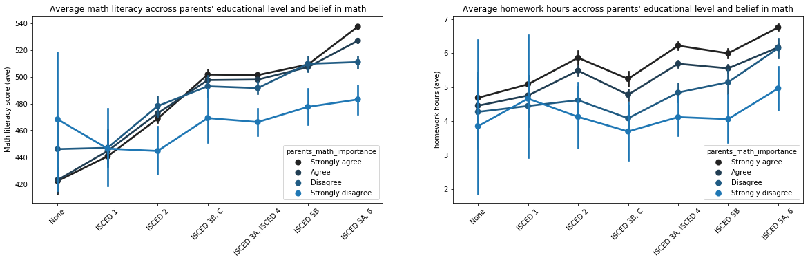


### Math literacy and homework hours by family structure for subjective norms (parents believe studying math is important)

Reproducing the same plot with family structure instead of highest educational level of parents. It shows that there is steep drop in math literacy rate in students who do not live with their parent.

The more the parents beleive in math, the better the stundens understand math and the more they do homework. By looking at each type of family structure, it is clear that the students who does no live with their parents scores low in terms of average math literacy and the hour they study.


```python
plt.figure(figsize = [20,5])

plt.subplot(1,2,1)
sb.pointplot(data = pisa, x = 'FAMSTRUC', y = 'MATH', hue = 'parents_math_importance' ,color = base_color)
plt.title("Average homework hours accross family structure and belief in math")
plt.ylabel('Math literacy (ave)')
plt.xlabel(None)
plt.xticks(rotation=45);

plt.subplot(1,2,2)
sb.pointplot(data = pisa, x = 'FAMSTRUC', y = 'HOMEWORK', hue = 'parents_math_importance' ,color = base_color)
plt.title("Average homework hours accross family structure and belief in math")
plt.ylabel('homework hours (ave)')
plt.xlabel(None)
plt.xticks(rotation=45);
```


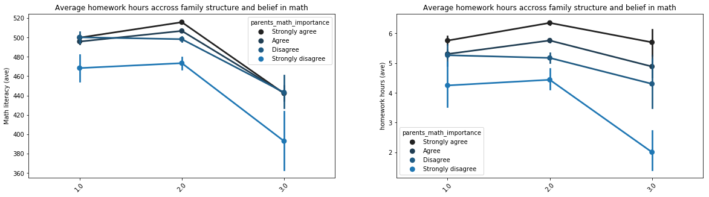
! jupyter nbconvert Communicate_Data_Project_Pisa_Part2.ipynb --to slides --post serve --template output_toggle
